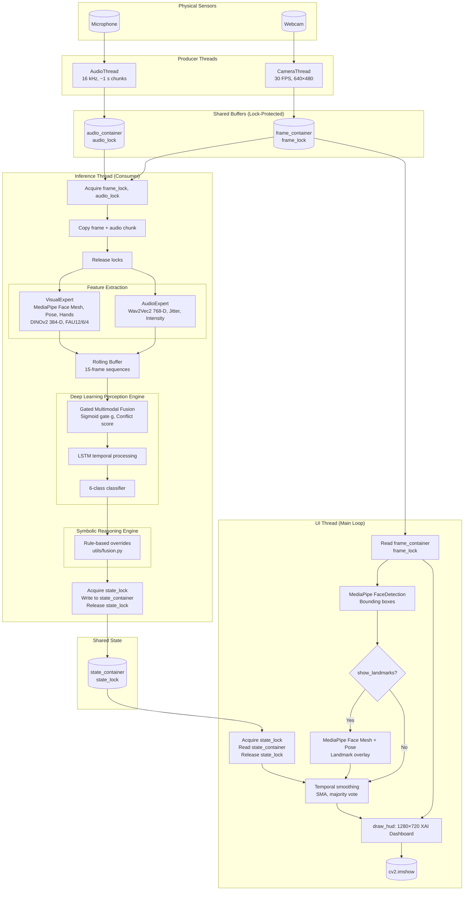

# 02 — System Architecture

## Chapter Overview

This document details the high-level data flow and concurrent processing architecture of **RHNS v2.0**. It comprises four sections: (1) theoretical background on real-time AI systems and the Producer-Consumer paradigm; (2) practical implementation of the threading model and data synchronization; (3) a system flowchart in Mermaid.js; and (4) an FAQ addressing anticipated defense queries.

---

# Part I — Theoretical Background (Real-Time AI Systems)

## 1.1 The Computational Bottleneck of Sequential Multimodal Inference

### 1.1.1 Pipeline Latency

RHNS v2.0 integrates three computationally intensive components: **DINOv2** (384-D visual embeddings), **Wav2Vec 2.0** (768-D acoustic embeddings), and an **LSTM-based fusion head** with Gated Multimodal Fusion. Executed **sequentially** with video capture—i.e., within a single-threaded loop that reads a frame, extracts features, runs inference, and renders—the pipeline incurs substantial latency:

| Stage | Approximate Latency (Edge Device) |
|-------|-----------------------------------|
| Frame capture (OpenCV) | ~5–10 ms |
| MediaPipe (Face Mesh + Pose + Hands) | ~15–30 ms |
| DINOv2 forward pass | ~20–50 ms |
| Wav2Vec 2.0 forward pass | ~30–80 ms |
| LSTM + GMF + classifier | ~5–15 ms |
| **Total (sequential)** | **~75–185 ms per frame** |

At 30 FPS, the inter-frame interval is ~33 ms. A sequential pipeline requiring 75–185 ms per frame cannot sustain real-time throughput. The camera would either block (dropping frames) or the display would freeze while waiting for inference to complete. User-perceived latency would exceed 100 ms, producing a sluggish, unresponsive experience.

### 1.1.2 Blocking I/O and Frame Drops

When capture, inference, and rendering share a single thread, **blocking** occurs at the slowest stage. If inference takes 150 ms, the capture loop cannot read the next frame until inference completes. During that interval, the camera buffer may overflow, causing frame drops, and the display cannot refresh. The system effectively serializes three distinct workloads—I/O-bound capture, compute-bound inference, and I/O-bound rendering—onto one execution context, underutilizing hardware and degrading responsiveness.

---

## 1.2 The Producer-Consumer Concurrent Design Pattern

### 1.2.1 Definition

The **Producer-Consumer** pattern decouples **data production** (capture) from **data consumption** (inference). Producers run in dedicated threads, writing to shared buffers or queues at their natural rate. Consumers run in separate threads, reading from those buffers at their own rate. Synchronization primitives (locks, semaphores) ensure that producers and consumers do not corrupt shared state.

### 1.2.2 Why It Is the Gold Standard for Real-Time Edge AI

For real-time edge AI architectures, the Producer-Consumer pattern is widely adopted because:

1. **Rate decoupling:** Capture can run at 30 FPS (33 ms/frame) while inference runs at 5 Hz (200 ms/cycle). Producers are not blocked by slow consumers; consumers process the *latest* available data rather than waiting for each frame.

2. **Hardware utilization:** I/O-bound threads (camera, microphone) can run concurrently with compute-bound threads (GPU/CPU inference). On multi-core systems, capture and inference utilize different cores, improving throughput.

3. **Latency isolation:** Slow inference does not block capture. The camera continues to update the shared buffer; when inference completes, it reads the most recent frame. The system trades *strict temporal alignment* (every frame processed) for *low capture latency* (always showing the latest frame).

4. **Predictability:** Each thread has a well-defined responsibility. Deadlocks and priority inversion are avoided by using coarse-grained locks and a simple data flow (producers write, consumer reads).

5. **Scalability:** Additional producers (e.g., a second camera) or consumers (e.g., a logging thread) can be added without restructuring the core loop.

---

## 1.3 The Decoupled UI/Inference Paradigm

### 1.3.1 Human Perception of UI Latency

Human perception of **display responsiveness** is highly sensitive to frame rate and input-to-display latency. For interactive applications:

- **Display refresh:** 30 FPS (~33 ms/frame) is generally sufficient for smooth video. Below ~24 FPS, motion appears choppy.
- **Input-to-display latency:** Users perceive delays above ~100 ms as sluggish. For real-time feedback (e.g., video calls, gaming), latency should ideally be <50 ms.

The **UI thread** must therefore refresh the display at a stable 30 FPS, regardless of how often the inference pipeline produces new predictions. If the UI waited for each inference result before rendering, the display would update at the inference rate (~5 Hz), producing a visibly stuttering interface.

### 1.3.2 Required Frequency of Neural Inference

Neural inference need not run at 30 FPS. Affective state changes occur on timescales of hundreds of milliseconds to seconds. A prediction rate of **5–10 Hz** is sufficient to track such changes. Running inference at 30 FPS would waste compute—the model would process nearly identical frames—without improving user-perceived quality.

### 1.3.3 Decoupling Principle

The **Decoupled UI/Inference** paradigm separates:

1. **UI thread:** Runs at 30 FPS. Reads the *latest* prediction from a shared `state_container`, applies temporal smoothing (e.g., SMA, majority vote), and renders the 1280×720 XAI Dashboard. It never blocks on inference.

2. **Inference thread:** Runs at a lower rate (e.g., 5 Hz). Produces predictions asynchronously and writes them to `state_container`. It never blocks on rendering.

The UI always displays the most recent *available* prediction. If inference has not completed since the last frame, the UI reuses the previous prediction (optionally with smoothing). From the user's perspective, the display updates smoothly at 30 FPS; the underlying state may update at 5 Hz. This design satisfies both the perceptual requirement (smooth display) and the computational constraint (inference cannot run at 30 FPS on edge hardware).

---

# Part II — Practical Implementation (The RHNS v2.0 Pipeline)

## 2.1 The Threading Model

RHNS v2.0 implements four logical execution contexts: three dedicated threads (Camera, Audio, Inference) and the main thread (UI loop). The following subsections detail each.

### 2.1.1 Capture Threads (Producers)

#### OpenCV Camera Thread

The **CameraThread** (`main.py`, `CameraThread` class) captures video from the default webcam at **640×480** and **30 FPS** (nominal). It runs a tight loop:

1. Call `cv2.VideoCapture.read()` to obtain the latest frame.
2. Acquire `frame_lock`.
3. Write `frame.copy()` to `frame_container["frame"]`.
4. Release `frame_lock`.
5. Sleep ~5 ms to avoid maxing out CPU.

The thread is instantiated as a **daemon thread** so that it terminates when the main process exits. The shared buffer is a **single-frame overwrite** (not a queue): each iteration replaces the previous frame. The inference thread always reads the *most recent* frame, accepting that older frames may be skipped when inference is slower than capture.

#### PyAudio Audio Thread

The **AudioThread** (`main.py`, `AudioThread` class) captures **16 kHz mono** audio in **~1-second chunks**. It uses PyAudio with `frames_per_buffer=1024` and collects samples until `rate` (16,000) samples are accumulated (~1 s). The raw bytes are written to `audio_container["chunk"]` under `audio_lock`. Like the camera, the buffer is overwritten each cycle—the inference thread reads the most recent 1 s chunk. Audio and video are **not** explicitly synchronized at capture; temporal alignment is handled during feature extraction (rolling buffers, sequence construction).

### 2.1.2 The Inference Thread (Consumer)

The **InferenceThread** performs the heavy lifting. It operates at a configurable interval (default **0.2 s**, i.e., ~5 Hz) and executes the following pipeline:

1. **Acquire locks and copy data:** Under `frame_lock` and `audio_lock`, copy the latest frame and audio chunk. Release locks immediately to avoid blocking producers.

2. **Visual Expert:** Call `VisualExpert.get_visual_summary(frame)`, which internally runs MediaPipe (Face Mesh, Pose, Hands), DINOv2, and computes FAU12, FAU6, FAU4, posture metrics (slump, asymmetry, lean, shoulders raised), and gestures (hand-to-face, finger tapping). Outputs: `visual_latent` (384-D), FAU dict, body_data.

3. **Audio Expert:** Call `AudioExpert.extract_features(audio_np)` for jitter and intensity; obtain `audio_latent` (768-D) via `get_latent_sequence()` for temporal alignment.

4. **Rolling buffer:** Append to `_seq_visual`, `_seq_audio`, `_seq_geometric` (maxlen=15). Build tensors of shape `(1, 15, dim)` for the fusion head.

5. **Neural inference:** Call `NuancedStateClassifier.predict(seq_vis, seq_aud, seq_geo)`. Outputs: base 6-class label, confidence, conflict score, gate weight.

6. **Symbolic Reasoning Engine:** Call `classify_nuanced_state(neural_state, confidence, fau, body_data, audio_data, synchrony_incongruent)`. Applies rule-based overrides (e.g., Hiding Stress, Panic, Contempt).

7. **Update state_container:** Under `state_lock`, write the final state, logic_source, FAU, audio_summary, conflict_score, gate_weight, posture flags, etc., to `state_container`.

The inference thread is the only consumer of `frame_container` and `audio_container`, and the only producer of `state_container`.

### 2.1.3 The UI Thread (Main Loop)

The **main thread** runs the UI loop. It does **not** perform neural inference. Its responsibilities are:

1. **Frame acquisition:** Under `frame_lock`, read `frame_container["frame"]`. If null, sleep briefly and retry.

2. **Face detection (standalone):** Run MediaPipe `FaceDetection` on the frame to obtain bounding boxes for the XAI Dashboard (sci-fi brackets, ROI PIP). This is a lightweight pass, separate from the VisualExpert used in inference.

3. **State read:** Under `state_lock`, read all fields from `state_container` (state, logic_source, fau, conflict_score, etc.). Release the lock immediately.

4. **Optional landmarks overlay:** If `show_landmarks` is enabled, run `ui_face_mesh.process()` and `ui_pose.process()` on the frame to obtain Face Mesh and Pose landmarks for drawing. These are **standalone** MediaPipe instances, decoupled from the inference pipeline.

5. **Temporal smoothing:** Apply SMA (window=5) to gate, conflict, confidence, sync_delay; apply majority vote to state and neural_state to reduce flicker.

6. **Rendering:** Call `draw_hud()` to composite the 1280×720 XAI Dashboard (video + panels). Display via `cv2.imshow()`.

7. **Frame rate control:** Sleep to maintain ~30 FPS (`frame_interval = 1/30`).

8. **Input handling:** Process keyboard input (q, r, v, a, l, c) for quit, rules toggle, blindfolds, landmarks, ROI.

The UI loop is designed for **zero-latency rendering** relative to inference: it never waits for the inference thread. It always renders using the latest available state.

---

## 2.2 Data Synchronization & Safety

### 2.2.1 Lock Usage

RHNS v2.0 uses Python's `threading.Lock()` for mutual exclusion:

| Lock | Protects | Writer | Reader |
|------|----------|--------|--------|
| `frame_lock` | `frame_container` | CameraThread | InferenceThread, Main loop |
| `audio_lock` | `audio_container` | AudioThread | InferenceThread |
| `state_lock` | `state_container` | InferenceThread | Main loop |

**Critical sections** are kept minimal. Producers acquire the lock, perform a single write (or a small set of writes), and release. Consumers acquire, perform a single read (or copy of required fields), and release. No long-running computation occurs while holding a lock.

### 2.2.2 The state_container Dictionary

The `state_container` is a shared dictionary that holds all outputs produced by the inference thread and consumed by the UI thread. Its structure (from `main.py`) includes:

```
state, logic_source, neural_state, finger_tapping, self_touching_hands,
hand_on_chin, hand_on_left_temple, hand_on_right_temple, hand_covering_mouth,
conflict_score, fau, audio_summary, confidence, sync_delay, micro_expression,
gate_weight, lean, is_slumped, shoulders_raised, posture_asymmetry
```

The inference thread writes these fields under `state_lock`; the main loop reads them under the same lock. Because the read is a bulk copy of scalar and dict values (no deep copy of large arrays), the critical section is short. **Race conditions** are avoided: the UI never reads a partially updated container (e.g., old state with new conflict_score), because each update is atomic with respect to the lock.

### 2.2.3 Overwrite Semantics

The shared buffers use **overwrite** semantics, not queues. The latest frame overwrites the previous; the latest audio chunk overwrites the previous; the latest state overwrites the previous. This design simplifies implementation and ensures that consumers always see the most recent data. The trade-off is that intermediate frames or states may be dropped when producers outpace consumers—which is acceptable for real-time affective recognition, where the current state matters more than a complete history.

---

# Part III — System Flowchart (Mermaid.js)

The following Mermaid diagram illustrates the end-to-end data flow from physical sensors to the XAI Dashboard.



---

# Part IV — Comprehensive FAQ (Anticipated Defense Queries)

## Q1: Why use a multithreaded Producer-Consumer model instead of a sequential while loop for video processing?

### Brief

A sequential loop would block capture and rendering on inference. With inference latency of 75–185 ms per frame, the system could not sustain 30 FPS capture or display. The Producer-Consumer model decouples capture (30 FPS) from inference (~5 Hz), allowing each to run at its natural rate without blocking the others.

### Detailed

In a sequential design, a single loop would: read frame → extract features → run inference → render. The loop iteration time is dominated by inference (~100–150 ms). The camera would be read at ~6–10 FPS instead of 30 FPS; the display would update at the same rate. Users would perceive severe lag and choppy video. The Producer-Consumer model assigns capture and inference to separate threads. The camera thread runs at 30 FPS, continuously updating a shared buffer. The inference thread runs at ~5 Hz, reading the latest frame when it is ready. The UI thread runs at 30 FPS, reading the latest inference result and rendering. No thread blocks another; each operates at its appropriate rate. The result is smooth 30 FPS display with inference updating at a lower, computationally feasible rate.

### Comprehensive

The sequential alternative violates two design requirements: (1) **real-time capture**—the camera must be polled frequently to avoid buffer overflow and to capture transient expressions; (2) **responsive UI**—human perception requires ~30 FPS for smooth motion. A sequential loop forces capture and UI to run at the inference rate, which is 5–10× slower. The Producer-Consumer model implements **rate decoupling**: producers (camera, microphone) run at their natural rate; the consumer (inference) runs at a rate determined by its computational cost. The shared buffer acts as a **temporal decoupler**—the latest value overwrites the previous, so the consumer always sees the most recent data. This design is standard in real-time systems (e.g., ROS, multimedia pipelines) because it maximizes throughput and minimizes latency for each component. The trade-off is that not every frame is processed; the inference thread may skip frames when the camera is faster. For affective recognition, this is acceptable because state changes occur on timescales of hundreds of milliseconds, and processing every 5th–6th frame is sufficient.

---

## Q2: How does the architecture handle the latency disparity between the 30 FPS UI and the slower Neural Inference rate?

### Brief

The UI thread runs at 30 FPS and reads the latest prediction from `state_container` each frame. When inference has not completed since the last read, the UI reuses the previous prediction. Temporal smoothing (SMA, majority vote) reduces flicker when the inference output updates sporadically.

### Detailed

The UI loop targets 30 FPS (`frame_interval = 1/30` s). Each iteration, it acquires `state_lock`, reads `state_container`, and releases the lock. The inference thread updates `state_container` at ~5 Hz. Thus, for 5–6 consecutive UI frames, the state may be unchanged. The UI displays the same prediction across those frames—which is correct behavior, since the affective state has not been recomputed. When inference completes, the next UI read obtains the new state. To avoid sudden jumps when the state does change, the system applies **temporal smoothing**: (1) **Majority vote** over a 5-frame window for categorical outputs (state, neural_state); (2) **Simple moving average** for numerical outputs (gate_weight, conflict_score, confidence, sync_delay). This reduces flicker when the inference output oscillates slightly between updates. The user perceives a smooth display that updates at 30 FPS, with the underlying state changing at the inference rate.

### Comprehensive

The architecture implements a **stale-read** strategy: the UI always displays the most recent *available* prediction, even if it is several hundred milliseconds old. This is acceptable because: (1) affective state changes are slow relative to 30 FPS; (2) a prediction that is 200 ms old is still valid for display purposes; (3) the alternative—blocking the UI until inference completes—would reduce the display rate to 5 FPS, which is unacceptable. The smoothing buffers (SMA, majority vote) serve two purposes: they reduce visual noise when the raw inference output fluctuates, and they interpolate between inference updates so the display does not appear to "freeze" between updates. The design is analogous to video buffering: the display shows the latest decoded frame; decoding runs asynchronously at a lower rate. The key invariant is that the UI never blocks on inference; it always renders within the 33 ms frame budget.

---

## Q3: Why is the MediaPipe geometry tracking run twice (once in the inference pipeline and once in the UI thread)?

### Brief

The inference pipeline needs MediaPipe (Face Mesh, Pose, Hands) for **feature extraction**—FAU values, posture, gestures—which feed the neural model and symbolic rules. The UI thread needs MediaPipe for **visualization**—drawing landmarks on the video when the user toggles the overlay. These are separate concerns; running them in the same thread would either block inference on rendering or block rendering on inference.

### Detailed

**Inference path:** The `VisualExpert` (used by the InferenceThread) runs MediaPipe Face Mesh, Pose, and Hands. It extracts FAU12, FAU6, FAU4, posture metrics (slump, asymmetry, lean), and gestures (hand-to-face, finger tapping). These are **numerical features**—they are passed to the fusion head and symbolic engine. The inference thread does not need to draw landmarks; it only needs the extracted values.

**UI path:** When the user presses `l` to toggle `show_landmarks`, the main loop runs `ui_face_mesh.process()` and `ui_pose.process()` on the current frame. These are **standalone** MediaPipe instances (different from the VisualExpert's internal instances). The output is used to draw Face Mesh and Pose landmarks on the video frame via `mp_drawing.draw_landmarks()`. This is purely for visualization.

**Why separate:** (1) **Decoupling:** The inference thread must run at its own pace (~5 Hz); the UI thread must run at 30 FPS. If the UI used the inference thread's MediaPipe output, it would need to wait for inference to complete, or the inference thread would need to pass landmarks to the UI—adding complexity and coupling. (2) **Frame alignment:** The UI draws landmarks on the *current* displayed frame. The inference thread processes frames asynchronously; its frame may not be the same as the one the UI is rendering. Running MediaPipe in the UI thread ensures the landmarks align with the displayed frame. (3) **Optional overhead:** The overlay is optional. When `show_landmarks` is off, the UI does not run MediaPipe at all. The inference pipeline always runs MediaPipe for feature extraction—it cannot be disabled without losing functionality.

### Comprehensive

The "double run" reflects a **separation of concerns** between inference and display. **Inference** requires MediaPipe for *computational* purposes: producing FAU intensities, posture flags, and gesture labels for the neural and symbolic models. **Display** requires MediaPipe for *visual* purposes: producing landmark coordinates for drawing. These outputs are used in different threads and at different rates. Merging them would require either: (a) the inference thread to pass landmarks to the UI (increasing `state_container` size and lock hold time), or (b) the UI to block on inference when landmarks are requested (violating the decoupled UI/Inference paradigm). Running MediaPipe twice—once per thread—is the cleanest design: each thread has its own pipeline, its own frame, and its own rate. The computational cost of the UI's MediaPipe pass when `show_landmarks` is on is acceptable because it runs at 30 FPS on a single frame and does not include DINOv2 or Wav2Vec 2.0. The Face Mesh and Pose models are lightweight relative to the full inference pipeline. The alternative—sharing a single MediaPipe instance across threads—would introduce race conditions and require locking around the MediaPipe process call, which would block one thread on the other and negate the benefits of concurrency.
